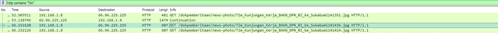
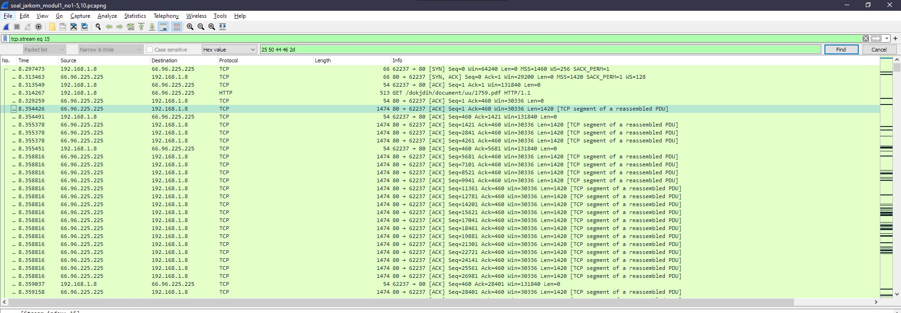

# Jarkom_Modul1_Lapres_B03

### 1. webserver yang digunakan pada "testing.mekanis.me"

### 2. Simpan gambar "Tim_Kunjungan_Kerja_BAKN_DPR_RI_ke_Sukabumi141436.jpg"
- Masukkan `http contains “Tim”` pada display filter

### 3. Cari username dan password ketika login di "ppid.dpr.go.id"
- Masukkan `http.host == "ppid.dpr.go.id" && http.request.method == POST` pada display filter 

### 4. Temukan paket dari web-web yang menggunakan basic authentication method
- Masukkan `http.authbasic` pada display filter

### 5. Ikuti perintah di aku.pengen.pw! Username dan password bisa didapatkan dari file .pcapng
- Masukkan `http.authbasic` pada display filter

### 6. Simpan dan Buka file "Open This.pdf" di Answer.zip
- Masukkan `ftp-data` pada display filter

### 7. Simpan dan Buka file pdf yang berisi puisi
- Masukkan `tcp contains "Yes"` pada display filter

- Simpan dan buka file pdf tersebut

### 8. Cari objek apa saja yang didownload (RETR) dari koneksi FTP dengan Microsoft FTP Service
- Masukkan `ftp.request.command == RETR && ip.dst == 198.246.117.106` pada display filter

### 9. Cari username dan password ketika login FTP pada localhost
- Masukkan `ftp` pada display filter

### 10. Cari file .pdf di wireshark lalu download dan buka file tersebut
- Masukkan `tcp contains "pdf"` pada display filter

- Simpan dan buka file pdf tersebut

### 11. Mengambil paket yang mengandung port 21
- Masukkan `port 21` pada capture filter. 

### 12. Mengambil paket yang berasal dari port 80
- Masukkan `src port 80` pada capture filter.

### 13. Menampilkan paket yang menuju port 443
- Masukkan `dst port 443` pada capture filter.

### 14. Mengambil paket yang berasal dari alamat ip
- Masukkan `src net 192.168.100.78` pada capture filter.

### 15. Mengambil paket yang tujuannya ke monta.if.its.ac.id
- Masukkan `dst host monta.if.its.ac.id` pada capture filter.

